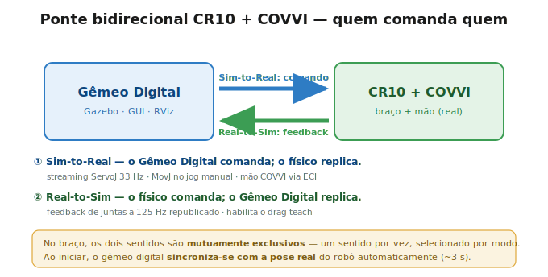
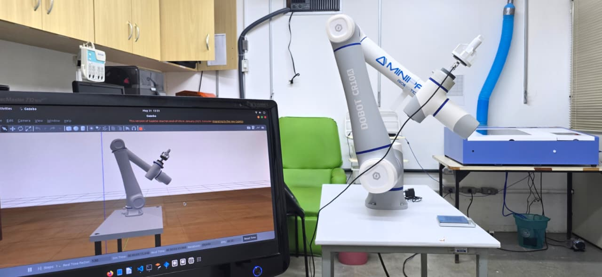
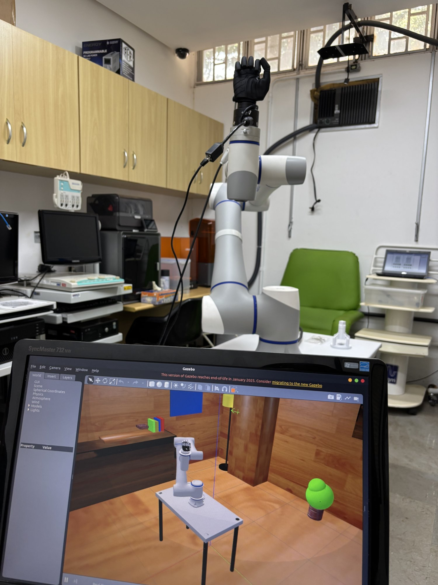
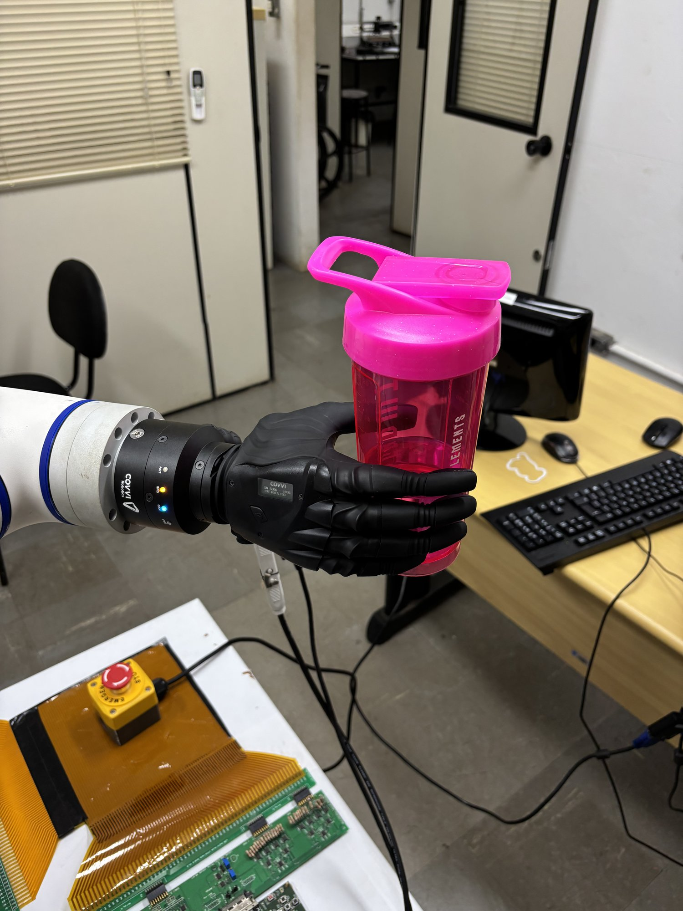
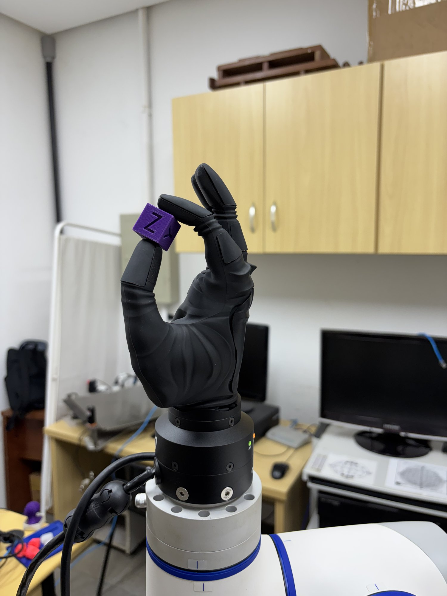
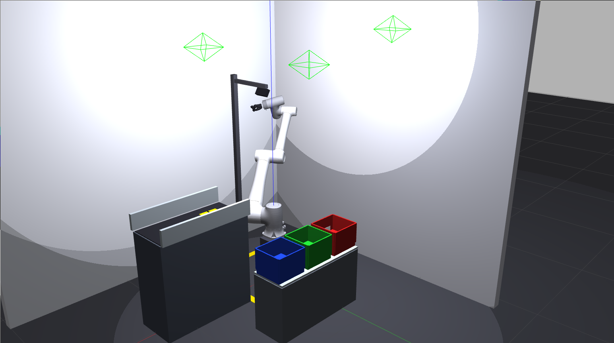
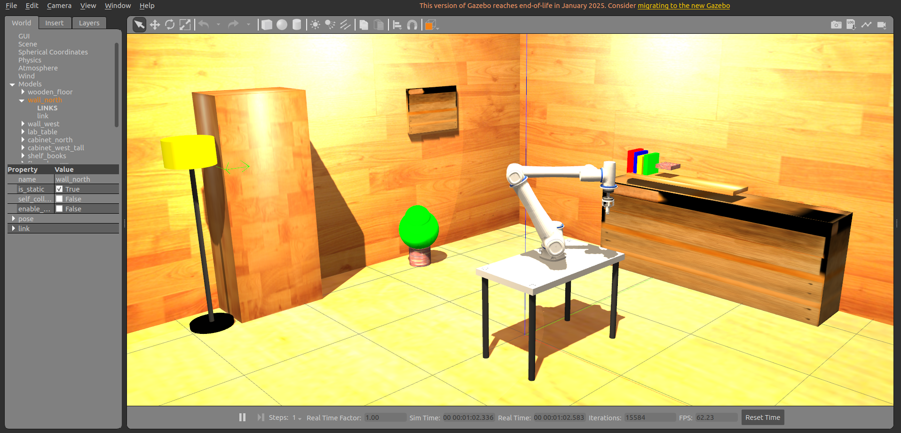
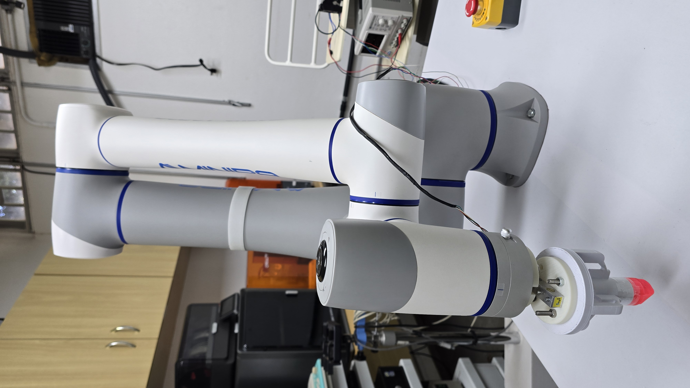
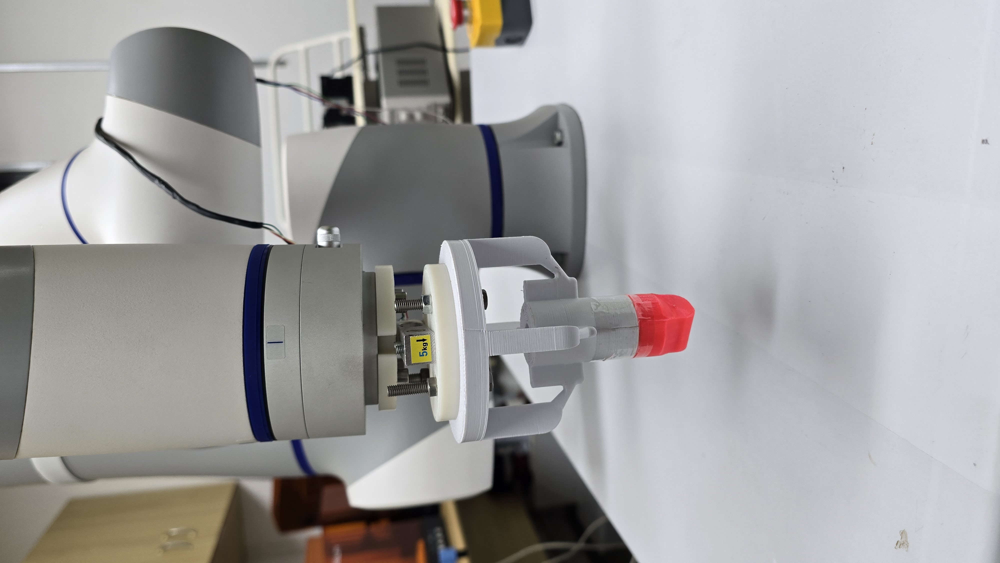

<div align="center">

# twinforge
### Digital Twin · CR10 + COVVI Hand · Biomedical Manufacturing Cell

[](https://docs.ros.org/en/humble/)
[](http://classic.gazebosim.org/)
[](https://releases.ubuntu.com/22.04/)
[](https://www.python.org/)
[](LICENSE)

</div>

<p align="center">
  
</p>
<p align="center"><em>The physical bench — <strong>Dobot CR10A</strong> with the <strong>COVVI Hand</strong> on the flange — next to the Gazebo digital twin running the same pose.</em></p>

Digital twin of the **Dobot CR10** industrial arm coupled to the **COVVI Hand** bionic prosthetic hand, running on **ROS 2 Humble / Gazebo Classic 11**. The system identifies pharmaceutical objects on a conveyor, classifies them by the grasp type they require and drops them into the correct bins — with a direct channel to the physical COVVI hand over the ECI Ethernet protocol.

Part of an **undergraduate thesis (TCC) in Biomedical Engineering** — a virtual platform to support the training of users of multi-DOF prosthetic hands. The same hardware (CR10 + COVVI) is reused in a second **tactile palpation** cell, which reproduces the protocol of Gupta et al. 2021 with force control and Cartesian sliding.

> 🎬 **Project overview video:** [`images/tcc_video_visao_geral.mp4`](images/tcc_video_visao_geral.mp4) *(11 MB — GitHub plays it in the file viewer)*
>
> 📘 **Interactive personal documentation** — block diagrams, gallery, **project assistant**, **force PID simulator** and **grasp selector**: [`docs/index.html`](docs/index.html) *(open in a browser)* · author **Lucas Martins Primo — 2026**.

---

## The sim ↔ real bridge

<p align="center">
  
</p>
<p align="center"><em>One direction at a time, selected by mode: <strong>Sim-to-Real</strong> (the twin commands, the hardware replicates — ServoJ streaming at 33 Hz, MovJ on manual jog, COVVI hand over ECI) and <strong>Real-to-Sim</strong> (the hardware commands, the twin replicates — joint feedback at 125 Hz, which enables drag teach). Diagram labels are in Portuguese.</em></p>

<p align="center">
  
</p>
<p align="center"><em>At startup, <code>real_pose_sync</code> reads the real arm's pose and drives Gazebo to it (~3 s), so the twin is born synchronized rather than in an arbitrary URDF pose.</em></p>

---

## Hardware

| Component | Model | Specifications |
|---|---|---|
| Arm | **Dobot CR10** | 6-DOF, 1375 mm reach, 10 kg payload, TCP/IP V4 protocol |
| Hand | **COVVI Hand** | 5 fingers + 31 joints (6 primary + 25 mimic), ECI Ethernet interface |
| Camera | Gazebo RGB | 848×480, 70° FoV, mounted behind the conveyor |
| Load cell | ESP32 + uniaxial sensor | UDP broadcast on 8080, 8 bytes per packet (`float v_sensor, float force`) |
| Touch sensor | STM32 + 4×4 array | USB-CDC at 115200 baud; Izhikevich neuromorphic model (RA/SA spikes + I_final). Optional UDP relay on 8081 |

<p align="center">
  
  
  
</p>
<p align="center"><em>The real hardware in the lab: the bench with the twin on screen · a <strong>power grasp</strong> on a bottle · a <strong>pinch grasp</strong> on a 3D-printed cube.</em></p>

---

## Full dependency list

### Operating system

| Dependency | Version |
|---|---|
| Ubuntu | 22.04 LTS |
| ROS 2 | Humble Hawksbill |
| Gazebo | Classic 11 |
| Python | 3.10+ |

### apt packages

```bash
sudo apt update && sudo apt install -y \
  ros-humble-gazebo-ros-pkgs \
  ros-humble-ros2-control \
  ros-humble-ros2-controllers \
  ros-humble-gazebo-ros2-control \
  ros-humble-xacro \
  ros-humble-joint-state-publisher-gui \
  ros-humble-vision-msgs \
  ros-humble-cv-bridge \
  ros-humble-control-msgs \
  ros-humble-admittance-controller \
  ros-humble-kinematics-interface-kdl \
  ros-humble-force-torque-sensor-broadcaster \
  python3-tk \
  python3-colcon-common-extensions \
  git
```

### Python

```bash
# numpy<2 is mandatory — Humble's cv_bridge is compiled against NumPy 1.x
pip install "numpy<2" opencv-python

# COVVI hand driver — proprietary ECI library from COVVI Robotics
pip install covvi-eci==1.1.6

# Optional — YOLOv8 detector (only grasp_ml_pack with use_yolo:=true)
pip install ultralytics
```

### External dependencies — already handled by the repository

| Package | Origin | How it gets in |
|---|---|---|
| `cra_description` | extracted from [`Dobot-Arm/DOBOT_6Axis_ROS2_V4`](https://github.com/Dobot-Arm/DOBOT_6Axis_ROS2_V4) | **already versioned** under `src/cra_description` — nothing to clone |
| `covvi_interfaces` + `covvi_hand_driver` (`src/eci_ros`) | **git submodule** | cloned automatically with `git clone --recursive` (see Installation) |

> **Credits — COVVI hand driver:** `src/eci_ros` is authored by **COVVI Robotics** ([`COVVI-Robotics/eci_ros`](https://github.com/COVVI-Robotics/eci_ros)). It is included as a submodule pointing to a fork ([`Martins-Lucaas/eci_ros`](https://github.com/Martins-Lucaas/eci_ros)) that **fully preserves the original authorship** and only adds a downstream fix for ECI session shutdown/reconnection.

> **Note:** even in simulation-only mode, `covvi_interfaces` must be built — several nodes lazily import those types to command the real hand when it is enabled.

---

## Installation

```bash
# 1. Clone the repository WITH the eci_ros submodule (COVVI hand driver)
git clone --recursive https://github.com/Martins-Lucaas/twinforge.git ~/twinforge
cd ~/twinforge

#    Already cloned without --recursive? Pull the submodule:
#    git submodule update --init --recursive

# 2. Install the dependencies (apt + Python — see "Full dependency list")

# 3. Build the whole workspace and source it
colcon build --symlink-install
source install/setup.bash
```

`cra_description` (the CR10 URDF) is already versioned in the repository; `eci_ros`
arrives through the submodule. Nothing beyond step 1 needs to be cloned.

> **Updating the submodule later:** `git submodule update --remote src/eci_ros`
> **`symbolic link ... Is a directory` error during the build:** `rm -rf build install && colcon build --symlink-install`
> **Always run `source install/setup.bash`** in every new terminal before any `ros2 launch`/`ros2 run`.

---

## Package guide

Each package documents how to run it in its own README.

<p align="center">
  
  
  
</p>
<p align="center"><em><code>grasp_ml_pack</code> — manufacturing cell · <code>touch_pack</code> — tactile palpation cell · <code>hand_pack</code> — combined CR10 + COVVI URDF.</em></p>

| Package | Main role | README |
|---|---|---|
| **`grasp_ml_pack`** | Manufacturing cell: conveyor, object detection, pick-and-place with COVVI | [→ grasp_ml_pack/README.md](src/grasp_ml_pack/README.md) |
| **`hand_pack`** | Combined CR10 + COVVI URDF, hand GUIs, launch helpers | [→ hand_pack/README.md](src/hand_pack/README.md) |
| **`touch_pack`** | Tactile palpation cell: Gupta 2021 protocol (Touch/Slide modes), GUI, logging, ESP32 load cell + STM32 touch sensor (Izhikevich) | [→ touch_pack/README.md](src/touch_pack/README.md) |
| **`cra_description`** | URDF/Xacro of the Dobot CR10 arm (extracted from the official Dobot repository) | [→ cra_description/README.md](src/cra_description/README.md) |

---

## Connecting the real hardware (optional)

- **COVVI hand:** from the GUI (`touch_pack`/`grasp_ml_pack`), enter the IP and click **Connect** → **ECI ON** → **PWR ON**. Internally this starts `ros2 run covvi_hand_driver server <IP>`.
- **CR10:** set `robot_ip` and use `control_mode:=mirror` (mirrors the real arm in sim) or `real_from_sim`. For *drag teach*, put the controller in **REMOTE mode** on the teach pendant.
- **Load cell (ESP32):** firmware under `sensors/ForceDriver/`; broadcasts over UDP on port 8080.
- **Touch sensor (STM32):** connects over USB (115200 baud) — the GUI reads the serial port directly in the **Sensors** tab; without a local serial port, relay it over UDP on port 8081 (`touch_receiver`).

<p align="center">
  
  
</p>
<p align="center"><em>The palpation end effector on the real CR10: the <strong>100 kg load cell</strong> sits between the printed couplers, with the contact tip at the end (photos show the earlier 5 kg build — same couplers and geometry). Swapping it for the COVVI hand is what <code>end_effector:=hand</code> vs <code>touch_tool</code> selects.</em></p>

---

## License

<div align="center">

**Apache-2.0**

Developed by **Lucas Martins** · [lucaspmartins14@gmail.com](mailto:lucaspmartins14@gmail.com)

TCC — Biomedical Engineering

</div>
