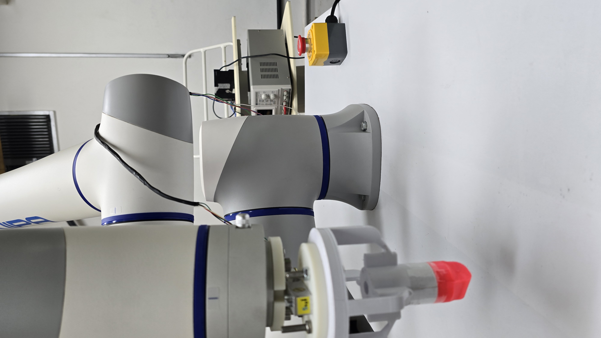

# cra_description

Package holding the **URDF/Xacro and meshes of the Dobot CR10 arm** (CR10A model, 6-DOF). Extracted from the official Dobot repository [`DOBOT_6Axis_ROS2_V4`](https://github.com/Dobot-Arm/DOBOT_6Axis_ROS2_V4) — only this package is used; the others (cr3, cr5, cr7, MoveIt, nova2, etc.) can be discarded.

<p align="center">
  
</p>
<p align="center"><em>URDF of the <strong>Dobot CR10</strong> (6-DOF) loaded into Gazebo Classic from this package's <code>cr10_robot.xacro</code>.</em></p>

<p align="center">
  
</p>
<p align="center"><em>The real arm this URDF models: the CR10 wrist (joint4–joint6) and the tool flange the project's end effectors bolt onto.</em></p>

---

## Contents

```
cra_description/
├── urdf/
│   └── cr10_robot.xacro          Main CR10 URDF (6 joints + ros2_control)
├── meshes/
│   └── *.stl / *.dae             Visual and collision meshes for each link
└── package.xml
```

---

## How to obtain it

```bash
cd ~/twinforge/src
git clone https://github.com/Dobot-Arm/DOBOT_6Axis_ROS2_V4.git

# Keep only cra_description
cd DOBOT_6Axis_ROS2_V4
find . -mindepth 1 -maxdepth 1 ! -name 'cra_description' -exec rm -rf {} +

# Or move it straight into src/ and delete the clone
cd ~/twinforge/src
mv DOBOT_6Axis_ROS2_V4/cra_description ./cra_description
rm -rf DOBOT_6Axis_ROS2_V4
```

---

## Use in the project

`cr10_robot.xacro` is processed at launch time by the `grasp_ml_pack` and `touch_pack` packages:

```python
import xacro
doc = xacro.parse(open(cr10_xacro_path))
xacro.process_doc(doc)
cr10_urdf = doc.toxml()
```

The resulting URDF gets the end effector (COVVI hand or touch_tool) injected into it and is published to `robot_state_publisher`. No modifications are made to the package's original files.

---

## Kinematic parameters (joints in URDF convention)

| Joint | xyz (m) | rpy (rad) |
|---|---|---|
| joint1 | `(0, 0, 0.1765)` | `(0, 0, 0)` |
| joint2 | `(0, 0, 0)` | `(π/2, π/2, 0)` |
| joint3 | `(-0.607, 0, 0)` | `(0, 0, 0)` |
| joint4 | `(-0.568, 0, 0.191)` | `(0, 0, -π/2)` |
| joint5 | `(0, -0.125, 0)` | `(π/2, 0, 0)` |
| joint6 | `(0, 0.1084, 0)` | `(-π/2, 0, 0)` |

The joint sign convention in the URDF is identical to the Dobot TCP/IP V4 firmware — offset `_URDF_DOBOT_OFFSET = np.zeros(6)` in `kinematics.py`.
