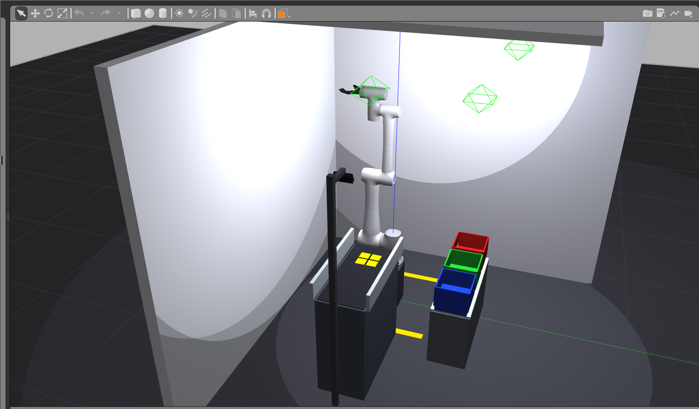
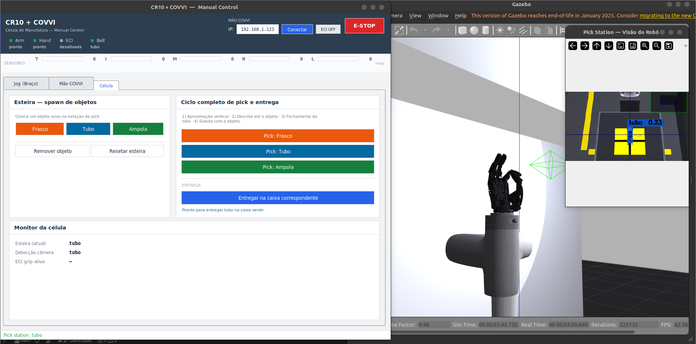
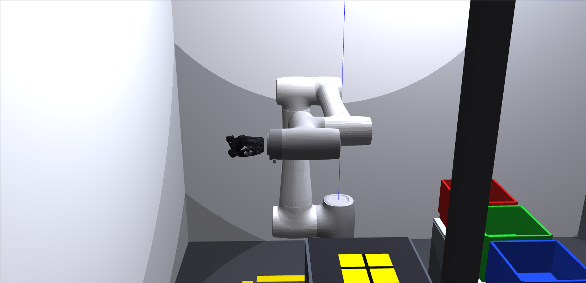
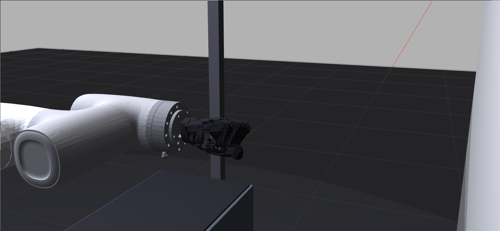

# grasp_ml_pack

Main package of the **biomedical manufacturing cell**. It integrates computer-vision object detection, CR10 arm kinematics, COVVI hand control and orchestration of the pick-and-place cycle in Gazebo — with an optional channel to the physical COVVI hand over ECI.

<p align="center">
  
  
</p>
<p align="center"><em>Left: the full cell in Gazebo (conveyor → pick station → bins). Right: the operation GUI during a grasp cycle.</em></p>

---

## Objects and grasps

| Object | Gazebo color | Grasp type | Destination |
|---|---|---|---|
| **Vial** (`frasco`) | Amber/orange (`H=8-26, S>120, V>80`) | Palm Grip | Box 1 — red |
| **Tube** (`tubo`) | Rich blue (`H=100-135, S>80, V>50`) | Claw Grip | Box 2 — green |
| **Ampoule** (`ampola`) | Bright green (`H=38-85, S>110, V>80`) | Fingertip Grip | Box 3 — blue |

<p align="center">
  
  
  
</p>
<p align="center"><em>COVVI hand grasp types: <strong>Palm Grip</strong> (vial) · <strong>Claw Grip</strong> (tube) · <strong>Fingertip Grip</strong> (ampoule).</em></p>

<p align="center">
  
</p>
<p align="center"><em>The three destination bins in Gazebo — <strong>red</strong> (vial) · <strong>green</strong> (tube) · <strong>blue</strong> (ampoule) — beside the conveyor and its pick station.</em></p>

> The object identifiers used in topics, services and code are the Portuguese ones: `frasco` (vial), `tubo` (tube), `ampola` (ampoule).

---

## Architecture

```
RGB camera (Gazebo)
  │ /camera/color/image_raw
  ▼
[object_detector]  — HSV (sim) or YOLOv8 (real) → bounding box + 3D position
  │ /detected_objects (Detection2DArray)
  ▼
[grasp_executor]   — picks grip + bin → IK → runs the F1-F7 cycle
  │ /conveyor/retreat
  ▼
[conveyor_controller] — spawns/deletes objects through Gazebo services
  ▲
  │ /conveyor/advance · /cell/execute_grasp · /cell/go_home
  │
[gui_control] / [manual_control] / [pipeline]
```

<p align="center">
  
</p>
<p align="center"><em>The <strong>Cell</strong> tab of <code>manual_control</code> next to Gazebo. The <em>Pick Station</em> camera window shows the live detection — here the <code>tubo</code> bounded and scored — while the cell monitor reports what the conveyor holds and what the camera sees.</em></p>

---

## Kinematics

Implemented in `grasp_ml_pack/kinematics.py` — **native URDF** convention (not DH).

### Arm forward kinematics — `forward_kinematics(q)`

Composes 6 URDF origin transforms and applies `T_HAND_ATTACH` to reach the
TCP (the convergence point of the fingertips). A **170.46 mm** translation in Z
from Link6 = prosthesis coupler **55.46 mm** + **115 mm** palm→TCP; the hand
attaches with `Rx(+90°)` (URDF), so that the finger direction coincides with
`+Link6_z` (the top-down approach axis).

| Joint | xyz (m) | rpy (rad) |
|---|---|---|
| joint1 | `(0, 0, 0.1765)` | `(0, 0, 0)` |
| joint2 | `(0, 0, 0)` | `(π/2, π/2, 0)` |
| joint3 | `(-0.607, 0, 0)` | `(0, 0, 0)` |
| joint4 | `(-0.568, 0, 0.191)` | `(0, 0, -π/2)` |
| joint5 | `(0, -0.125, 0)` | `(π/2, 0, 0)` |
| joint6 | `(0, 0.1084, 0)` | `(-π/2, 0, 0)` |

### Arm inverse kinematics — `inverse_kinematics(p_tcp, approach_vec, ...)`

1. Geometric multi-start: 14 seeds per call (q1 sweep of ±0.7 rad, two elbow branches).
2. Analytic wrist: extracts q4–q6 with both signs of q5.
3. Decoupled DLS refinement: 4 cycles (3-DOF arm DLS + analytic wrist recomputation) plus 100 iterations of 6-DOF DLS with adaptive λ.
4. Branch locking: rejects solutions with `|Δj1| > 60°` or `|Δj2| > 60°` relative to the seed.

Joint limits (URDF):
```
JOINT_MIN = [-180°, -260°, -135°, -260°, -135°, -360°]
JOINT_MAX = [+180°,   80°, +135°,   80°, +135°, +360°]
```

### Hand kinematics — `hand_fk(hand_state)`

Returns the 3D position of the fingertips, MCPs and `palm_center` in `hand_base_link`.
`grasp_center_in_hand` uses those points to align the grasp center with the
object center before running the arm IK.

**Per-finger real FK (from the URDF).** Each finger uses **its own** real
kinematic chain (origins, axes and mimic ratios) extracted from
`linear_covvi_hand_gazebo.urdf`; the tip comes from the most distal vertex of
the distal phalanx STL. This replaces the old approximate planar 2-link model,
which used a **single phalanx length (45 mm)** for every finger and placed the
`grasp_center` ~60 mm off — the cause of the grotesquely missed picks. The
chains are precomputed in `_FINGER_CHAINS` (generated offline; do not edit by
hand).

Real geometry extracted from the URDF (`hand_base_link` frame):

| Measurement | Value |
|---|---|
| Proximal phalanx (MCP→DIP) | Thumb 60.8 · Index 30.0 · Middle 34.0 · Ring 32.0 · Little 24.0 mm |
| Hand center → finger base (‖MCP‖) | ~95 mm (long fingers) · 51.9 mm (thumb) |
| Finger-to-finger (adjacent MCPs) | ~20 mm · Thumb–Index 77.5 mm |
| Link6→hand coupler | 55.46 mm + `Rx(90°)` |

Numerical validation (arm + hand FK, closed loop): the `grasp_center` lands on
the object center within **~2 mm** (was ~60 mm) for the vial and the ampoule.

### Checking the IK

```bash
# Quick FK→IK round trip (Python):
python3 -c "from grasp_ml_pack.kinematics import forward_kinematics, inverse_kinematics; \
import numpy as np; q=np.array([.3,-.3,-1.3,-1.4,.4,.1]); T=forward_kinematics(q); \
qs,ok=inverse_kinematics(T[:3,3],T[:3,2],q_seed=q); print('ok',ok)"
```

> Note: the `test_kin` entry point (`scripts/test_kinematics.py`) is out of date
> (it imports `DH_CR10`, which was removed in the refactor to the URDF
> convention) and fails — use the round trip above until the script is fixed.

---

## Grasp cycle (F1–F7)

| Phase | Action | Type |
|---|---|---|
| F1 | HOME → APPROACH (60 mm above the pick, hand open) | Joint |
| F1.5 | Per-object hand pre-shape | Hand |
| F1.55 | Tube only — step-aside −X 50 mm | Cartesian |
| F1.6 | APPROACH → PICK (descent with the hand pre-shaped) | Joint |
| F2:CAGE | Cage check: validates fingertip geometry against the object AABB | Check |
| F2 | `PerfectGrasp.close_until_contact` — incremental closing with lag detection | Hand |
| F3 | Lift with the object (+22 cm) | Joint |
| F4 | Lateral transit through via_box (`z=1.15 m`) | Cartesian |
| F5 | Descent → approach_box | Cartesian |
| F6 | Release above the bin → `/conveyor/retreat` | Cartesian |
| F7 | Return HOME | Cartesian |

<p align="center">
  
  
</p>
<p align="center"><em><strong>F1</strong> — APPROACH, 60 mm above the pick with the hand open (left) → <strong>F1.6</strong> — descent to PICK with the hand already pre-shaped (right).</em></p>

**PerfectGrasp:** ramps at 0.06 rad / 100 ms; detects contact when `lag = commanded − actual > 0.04 rad` for 2 ticks; freezes the finger on contact. Prevents ejecting the object.

**Cage check** (`cage_check.py`): validates fingertip_z and r_tip against the object AABB. Non-fatal — it logs a warning if invalid, and PerfectGrasp still runs.

### Pick target (dynamic IK + collision)

`grasp_executor` solves the poses **at the object's real position** read from
`/gazebo/model_states` (`_solve_grasp_poses_at`); the TCP targets
(`PICK_TCP_WORLD` in `poses.py`) are computed from the hand's real
`grasp_center`. The poses cached in `poses.py` serve as a **seed** and a
**fallback** (regenerate them with `GRASP_RECOMPUTE_POSES=1` +
`recompute_and_print_poses`).

The PICK is solved **with collision checking that tolerates only `belt_surface`**
(the thin slab on top of the conveyor where the object rests — not a real
obstacle for the wrist that has to pick it up); the solid `belt_frame` structure
is still checked. Without a safe solution, the executor falls back to the
known-good cached pose instead of executing a bad IK branch.

> **Tube (lateral grasp):** with the corrected geometry, the only branch that
> reaches the tube center sinks the flange ~2 mm into `belt_frame`, so the tube
> runs on the **safe fallback** (cached pose). Adjust the clearance/height of
> the lateral approach and validate it in Gazebo before regenerating the tube
> pose. The vial and the ampoule (top-down) use the corrected dynamic IK
> normally.

<p align="center">
  
  
</p>
<p align="center"><em>The <strong>lateral approach</strong> used for the tube. It is this branch that brings the flange within ~2 mm of <code>belt_frame</code>, which is why the tube runs on the cached fallback pose.</em></p>

---

## How to run

```bash
source install/setup.bash
ros2 launch grasp_ml_pack conveyor_cell.launch.py
```

It is ready when the terminal shows:
```
[conveyor_controller] ConveyorController pronto | sequência: ['frasco', 'tubo', 'ampola']
[grasp_executor]      GraspExecutor pronto.
[object_detector]     ObjectDetector pronto — modo: HSV-simulação
```

### Launch arguments

| Argument | Default | Effect |
|---|---|---|
| `use_yolo` | `false` | Enables the YOLOv8 detector (requires `pip install ultralytics`) |
| `no_gui` | `false` | Does not start `gui_control` |
| `autonomous` | `false` | `pipeline` runs advance→detect→execute in a loop |
| `sim_only` | `true` | `false` disables the simulated part of the conveyor |

```bash
ros2 launch grasp_ml_pack conveyor_cell.launch.py no_gui:=true autonomous:=true
ros2 launch grasp_ml_pack conveyor_cell.launch.py use_yolo:=true
```

---

## Executables

```bash
# Cell nodes (started by the launch, but they run standalone if Gazebo + controllers are already up)
ros2 run grasp_ml_pack object_detector      # object detector only
ros2 run grasp_ml_pack grasp_executor       # pick-place cycle executor only
ros2 run grasp_ml_pack conveyor_controller  # conveyor controller only
ros2 run grasp_ml_pack pipeline             # status orchestrator/aggregator only

# GUIs
ros2 run grasp_ml_pack gui_control      # default GUI: conveyor + grasp
ros2 run grasp_ml_pack manual_control   # per-joint sliders + ECI grips (CRStudio-style, 3 tabs)

# Kinematics (unit test — currently broken, see "Checking the IK")
ros2 run grasp_ml_pack test_kin
```

### Tuning and test scripts

Run with `python` from inside the built workspace:

```bash
python src/grasp_ml_pack/scripts/test_kinematics.py   # validates FK/IK for the 3 objects
python src/grasp_ml_pack/scripts/test_9cycles.py      # stress test: 9 consecutive cycles
python src/grasp_ml_pack/scripts/tune_descent.py      # interactive tuning of the descent phase
python src/grasp_ml_pack/scripts/tune_rotate.py       # wrist orientation tuning (joint6)
```

### `manual_control` GUI

- 6 arm sliders (joint1–joint6, in degrees, with URDF limits)
- 6 hand sliders (Thumb/Index/Middle/Ring/Little/Rotate)
- Precomputed pose buttons (Pick vial/tube/ampoule)
- Project grasp buttons (Palm/Claw/Fingertip → Gazebo)
- 14 native ECI grips (Tripod/Power/Trigger/Prec.Open/...) → Gazebo + real hand
- **Real Hand** toggle — enables sending commands to the physical hand over ECI

<p align="center">
  
  
</p>
<p align="center"><em>Left: the <strong>Arm Jog</strong> tab (<code>Jog (Braço)</code>) — per-joint sliders with the URDF limits shown, plus Home/Vertical/Extended poses. Right: the <strong>COVVI Hand</strong> tab (<code>Mão COVVI</code>) — the six digits (0 = open, 200 = closed), the three project grasps and the 14 built-in ECI grips. The GUI labels are in Portuguese.</em></p>

Custom ECI prefix:
```bash
ros2 run grasp_ml_pack manual_control --ros-args -p eci_prefix:=/my/hand
```

---

## Topics and services

| Topic / Service | Type | Description |
|---|---|---|
| `/camera/color/image_raw` | `sensor_msgs/Image` | Raw camera RGB |
| `/detector/debug_image` | `sensor_msgs/Image` | Image annotated with bounding boxes |
| `/detected_objects` | `vision_msgs/Detection2DArray` | Class + 3D position |
| `/conveyor/advance` | `std_srvs/Trigger` | Spawns the next object |
| `/conveyor/retreat` | `std_srvs/Trigger` | Removes the current object |
| `/conveyor/reset` | `std_srvs/Trigger` | Restarts the sequence |
| `/conveyor/spawn_{frasco,tubo,ampola}` | `std_srvs/Trigger` | Specific spawn |
| `/cell/execute_grasp` | `std_srvs/Trigger` | Triggers the F1–F7 cycle |
| `/cell/go_home` | `std_srvs/Trigger` | Sends the arm home |
| `/cell/status` | `std_msgs/String` JSON | Executor state |
| `/cr10_group_controller/joint_trajectory` | `trajectory_msgs/JointTrajectory` | Arm commands |
| `/hand_position_controller/joint_trajectory` | `trajectory_msgs/JointTrajectory` | Simulated hand commands |
| `/covvi/hand/SetCurrentGrip` | `covvi_interfaces/srv/SetCurrentGrip` | (Real) Native grip |
| `/covvi/hand/SetDigitPosn` | `covvi_interfaces/srv/SetDigitPosn` | (Real) Absolute positions of the 6 digits |

---

## Connecting the real COVVI hand

<p align="center">
  
  
</p>
<p align="center"><em>The physical hand executing a <strong>power grasp</strong> on a bottle and a <strong>pinch</strong> on a printed cube, driven over ECI from the same GUI that drives the simulation.</em></p>

### Prerequisites

- `eci_ros-main` built in the workspace (installation step 2)
- Hand connected to the network with a reachable IP (factory default: `192.168.1.123`)
- PC on the same subnet:

```bash
sudo ip addr add 192.168.1.10/24 dev <interface>
ping 192.168.1.123   # must reply
```

### ECI server

```bash
# Terminal A — keep it running the whole time
ros2 run covvi_hand_driver server 192.168.1.123 \
    --ros-args --remap __ns:=/covvi --remap __name:=hand
```

### Power on and verify

```bash
ros2 service call /covvi/hand/SetHandPowerOn covvi_interfaces/srv/SetHandPowerOn
ros2 service call /covvi/hand/GetHello covvi_interfaces/srv/GetHello
ros2 service call /covvi/hand/GetDeviceIdentity covvi_interfaces/srv/GetDeviceIdentity
```

### Telemetry

```bash
ros2 service call /covvi/hand/EnableAllRealtimeCfg covvi_interfaces/srv/EnableAllRealtimeCfg
ros2 topic echo /covvi/hand/DigitPosnAllMsg    # real positions 0–255
ros2 topic echo /covvi/hand/CurrentGripMsg     # active grip
ros2 topic echo /covvi/hand/MotorCurrentAllMsg # motor currents
ros2 topic echo /covvi/hand/DigitErrorMsg      # per-digit errors
```

### Motion commands

```bash
# Open (position 40 ≈ ECI minimum)
ros2 service call /covvi/hand/SetDigitPosn covvi_interfaces/srv/SetDigitPosn \
"{speed: {value: 100}, thumb: 40, index: 40, middle: 40, ring: 40, little: 40, rotate: 40}"

# Close (position 200 ≈ ECI maximum)
ros2 service call /covvi/hand/SetDigitPosn covvi_interfaces/srv/SetDigitPosn \
"{speed: {value: 50}, thumb: 200, index: 200, middle: 200, ring: 200, little: 200, rotate: 200}"

# Native grips: 1=Tripod 2=Power 3=Trigger 4=Prec.Open 5=Prec.Closed
#               6=Key 7=Finger 8=Cylinder 9=Column 10=Relaxed 11=Glove 12=Tap 13=Grab 14=Tripod Open
ros2 service call /covvi/hand/SetCurrentGrip covvi_interfaces/srv/SetCurrentGrip "{grip_id: {value: 2}}"
```

### Shutting down safely

```bash
ros2 service call /covvi/hand/SetCurrentGrip covvi_interfaces/srv/SetCurrentGrip "{grip_id: {value: 10}}"
ros2 service call /covvi/hand/ResetRealtimeCfg covvi_interfaces/srv/ResetRealtimeCfg
ros2 service call /covvi/hand/SetHandPowerOff covvi_interfaces/srv/SetHandPowerOff
```

> **Warning:** always go through `SetHandPowerOff` before cutting the power supply — this avoids a firmware protection state.

### Using Real Hand from the GUI

1. Start the cell: `ros2 launch grasp_ml_pack conveyor_cell.launch.py no_gui:=true`
2. Open: `ros2 run grasp_ml_pack manual_control`
3. Click **Real Hand: OFF** to enable mirroring
4. Sliders → `SetDigitPosn` with a 150 ms debounce; ECI grips → `SetCurrentGrip`

---

## Common problems

| Symptom | Cause | Action |
|---|---|---|
| `ping 192.168.1.123` does not reply | The PC's IP is outside the subnet | `sudo ip addr add 192.168.1.10/24 dev <iface>` |
| ECI server stuck at `Connecting...` | Hand powered off or another process is connected | `pkill -f covvi_hand_driver` and power-cycle the hand |
| `Real Hand: ON` but grips do not arrive | The server is not on `/covvi/hand` | `ros2 service list \| grep covvi`; check `eci_prefix` |
| `ModuleNotFoundError: covvi_interfaces` | `eci_ros-main` not built | `colcon build --packages-select covvi_interfaces && source install/setup.bash` |
| Gazebo freezes when a trajectory is sent | Controller not active | `ros2 control list_controllers` — check for `active` |
| Hand shakes when it receives a grip | Motor unpowered | `SetHandPowerOn` before the first command |

---

## Useful commands

```bash
# Rebuild only this package
colcon build --packages-select grasp_ml_pack --symlink-install && source install/setup.bash

# View the camera with bounding boxes
ros2 run rqt_image_view rqt_image_view /detector/debug_image

# Controls from the terminal
ros2 service call /conveyor/advance std_srvs/srv/Trigger {}
ros2 service call /cell/execute_grasp std_srvs/srv/Trigger {}
ros2 service call /cell/go_home std_srvs/srv/Trigger {}

# Controller states
ros2 control list_controllers

# Kill a frozen Gazebo
pkill -f gzserver; pkill -f gzclient
```
