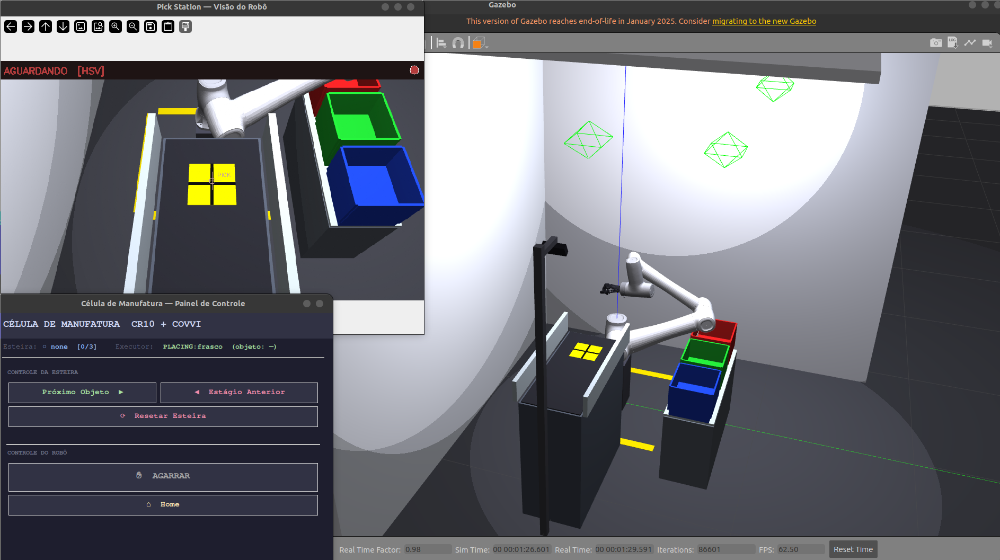
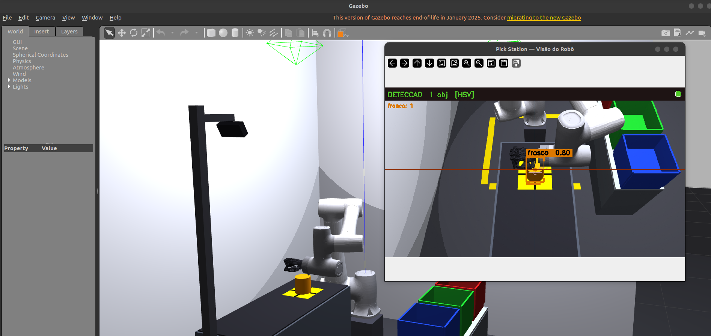
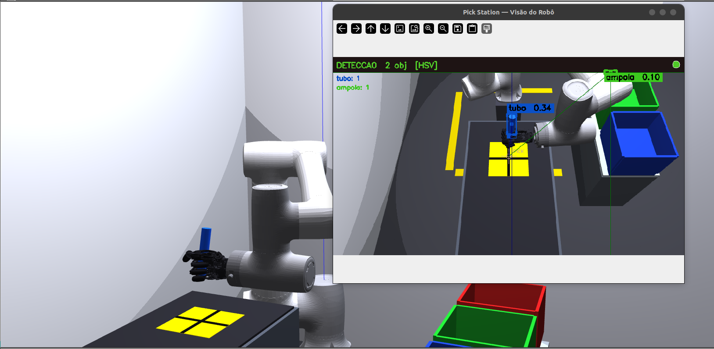
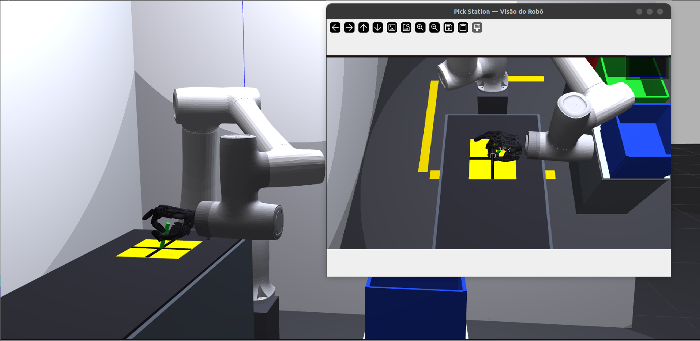

# grasp_ml_pack

Pacote principal da **célula de manufatura biomédica**. Integra detecção de objetos por visão computacional, cinemática do braço CR10, controle da mão COVVI e orquestração do ciclo de pick-and-place em Gazebo — com canal opcional para a mão COVVI física via ECI.

<p align="center">
  
  
</p>
<p align="center"><em>Esquerda: célula completa no Gazebo (esteira → estação de pick → caixas). Direita: GUI de operação durante o ciclo de preensão.</em></p>

---

## Objetos e preensões

| Objeto | Cor Gazebo | Tipo de Grasp | Destino |
|---|---|---|---|
| **Frasco** | Âmbar/laranja (`H=8-26, S>120, V>80`) | Palm Grip | Box 1 — vermelha |
| **Tubo** | Azul rico (`H=100-135, S>80, V>50`) | Claw Grip | Box 2 — verde |
| **Ampola** | Verde brilhante (`H=38-85, S>110, V>80`) | Fingertip Grip | Box 3 — azul |

<p align="center">
  
  
  
</p>
<p align="center"><em>Tipos de preensão da mão COVVI: <strong>Palm Grip</strong> (frasco) · <strong>Claw Grip</strong> (tubo) · <strong>Fingertip Grip</strong> (ampola).</em></p>

---

## Arquitetura

```
Câmera RGB (Gazebo)
  │ /camera/color/image_raw
  ▼
[object_detector]  — HSV (sim) ou YOLOv8 (real) → bounding box + posição 3D
  │ /detected_objects (Detection2DArray)
  ▼
[grasp_executor]   — escolhe grip + caixa → IK → executa ciclo F1-F7
  │ /conveyor/retreat
  ▼
[conveyor_controller] — spawn/delete de objetos via Gazebo services
  ▲
  │ /conveyor/advance · /cell/execute_grasp · /cell/go_home
  │
[gui_control] / [manual_control] / [pipeline]
```

---

## Cinemática

Implementada em `grasp_ml_pack/kinematics.py` — convenção **URDF nativa** (não DH).

### Cinemática direta do braço — `forward_kinematics(q)`

Compõe 6 transformações origem URDF e aplica `T_HAND_ATTACH` para chegar ao
TCP (ponto de convergência dos fingertips). Translação **170.46 mm** em Z do
Link6 = acoplador da prótese **55.46 mm** + **115 mm** palma→TCP; a mão
acopla com `Rx(+90°)` (URDF), de modo que a direção dos dedos coincide com
`+Link6_z` (eixo de aproximação top-down).

| Junta | xyz (m) | rpy (rad) |
|---|---|---|
| joint1 | `(0, 0, 0.1765)` | `(0, 0, 0)` |
| joint2 | `(0, 0, 0)` | `(π/2, π/2, 0)` |
| joint3 | `(-0.607, 0, 0)` | `(0, 0, 0)` |
| joint4 | `(-0.568, 0, 0.191)` | `(0, 0, -π/2)` |
| joint5 | `(0, -0.125, 0)` | `(π/2, 0, 0)` |
| joint6 | `(0, 0.1084, 0)` | `(-π/2, 0, 0)` |

### Cinemática inversa do braço — `inverse_kinematics(p_tcp, approach_vec, ...)`

1. Multi-start geométrico: 14 sementes por chamada (varredura de q1 ±0.7 rad, dois ramos de cotovelo).
2. Wrist analítico: extrai q4–q6 com dois sinais de q5.
3. Refinamento DLS desacoplado: 4 ciclos (DLS 3-DOF braço + recálculo analítico pulso) + 100 iterações DLS 6-DOF com λ adaptativo.
4. Branch-locking: rejeita soluções com `|Δj1| > 60°` ou `|Δj2| > 60°` em relação à semente.

Limites articulares (URDF):
```
JOINT_MIN = [-180°, -260°, -135°, -260°, -135°, -360°]
JOINT_MAX = [+180°,   80°, +135°,   80°, +135°, +360°]
```

### Cinemática da mão — `hand_fk(hand_state)`

Retorna posição 3D de fingertips, MCPs e `palm_center` em `hand_base_link`.
A `grasp_center_in_hand` usa esses pontos para alinhar o centro de preensão
com o centro do objeto antes do IK do braço.

**FK real por dedo (via URDF).** Cada dedo usa a **sua** cadeia cinemática
real (origens, eixos e razões de mimic) extraída de
`linear_covvi_hand_gazebo.urdf`; a ponta vem do vértice mais distal do STL
da falange distal. Substitui o antigo modelo 2-link planar aproximado, que
usava um comprimento de falange **único (45 mm)** para todos os dedos e
colocava o `grasp_center` ~60 mm fora — causa dos picks que erravam de forma
grotesca. As cadeias estão pré-computadas em `_FINGER_CHAINS` (geradas
offline; não editar à mão).

Geometria real extraída do URDF (frame `hand_base_link`):

| Medida | Valor |
|---|---|
| Falange proximal (MCP→DIP) | Polegar 60.8 · Indicador 30.0 · Médio 34.0 · Anelar 32.0 · Mínimo 24.0 mm |
| Centro da mão → base do dedo (‖MCP‖) | ~95 mm (dedos longos) · 51.9 mm (polegar) |
| Dedo-a-dedo (MCPs adjacentes) | ~20 mm · Polegar–Indicador 77.5 mm |
| Acoplador Link6→mão | 55.46 mm + `Rx(90°)` |

Validação numérica (FK braço + mão, malha fechada): o `grasp_center` cai no
centro do objeto com **~2 mm** (era ~60 mm) para frasco e ampola.

### Verificar IK

```bash
# Round-trip rápido FK→IK (Python):
python3 -c "from grasp_ml_pack.kinematics import forward_kinematics, inverse_kinematics; \
import numpy as np; q=np.array([.3,-.3,-1.3,-1.4,.4,.1]); T=forward_kinematics(q); \
qs,ok=inverse_kinematics(T[:3,3],T[:3,2],q_seed=q); print('ok',ok)"
```

> Nota: o entry point `test_kin` (`scripts/test_kinematics.py`) está
> desatualizado (importa `DH_CR10`, removido no refactor para convenção
> URDF) e falha — usar o round-trip acima até o script ser corrigido.

---

## Ciclo de grasp (F1–F7)

| Fase | Ação | Tipo |
|---|---|---|
| F1 | HOME → APPROACH (60 mm acima do pick, mão aberta) | Articular |
| F1.5 | Pré-shape da mão por objeto | Mão |
| F1.55 | Tubo apenas — step-aside −X 50 mm | Cartesiano |
| F1.6 | APPROACH → PICK (descida com mão em pre-shape) | Articular |
| F2:CAGE | Cage check: valida geometria fingertips vs AABB do objeto | Check |
| F2 | `PerfectGrasp.close_until_contact` — fechamento incremental com lag-detection | Mão |
| F3 | Levantar com objeto (+22 cm) | Articular |
| F4 | Trânsito lateral via via_box (`z=1.15 m`) | Cartesiano |
| F5 | Descida → approach_box | Cartesiano |
| F6 | Soltar acima da caixa → `/conveyor/retreat` | Cartesiano |
| F7 | Retorno HOME | Cartesiano |

**PerfectGrasp:** ramp de 0.06 rad / 100 ms; detecta contato por `lag = commanded − actual > 0.04 rad` por 2 ticks; congela o dedo no contato. Evita ejeção do objeto.

**Cage check** (`cage_check.py`): valida fingertip_z, r_tip vs AABB do objeto. Não-fatal — loga warn se inválido, o PerfectGrasp ainda executa.

### Alvo de pick (IK dinâmica + colisão)

O `grasp_executor` resolve as poses **na posição real do objeto** lida de
`/gazebo/model_states` (`_solve_grasp_poses_at`); os alvos de TCP
(`PICK_TCP_WORLD` em `poses.py`) são computados a partir do `grasp_center`
real da mão. As poses cacheadas em `poses.py` servem de **semente** e
**fallback** (regenerar com `GRASP_RECOMPUTE_POSES=1` +
`recompute_and_print_poses`).

O PICK é resolvido **com checagem de colisão tolerando apenas `belt_surface`**
(a laje fina do topo da esteira onde o objeto repousa — não é obstáculo real
para o punho que precisa pegá-lo); a estrutura sólida `belt_frame` continua
verificada. Sem solução segura, o executor cai na pose cacheada conhecida-boa
em vez de executar um ramo IK ruim.

> **Tubo (grasp lateral):** com a geometria corrigida, o único ramo que
> atinge o centro do tubo mergulha o flange ~2 mm no `belt_frame`, então o
> tubo opera no **fallback seguro** (pose cacheada). Ajustar a folga/altura
> do approach lateral e validar no Gazebo antes de regenerar a pose do tubo.
> Frasco e ampola (top-down) usam o IK dinâmico corrigido normalmente.

---

## Iniciar

```bash
source install/setup.bash
ros2 launch grasp_ml_pack conveyor_cell.launch.py
```

Pronto quando o terminal mostrar:
```
[conveyor_controller] ConveyorController pronto | sequência: ['frasco', 'tubo', 'ampola']
[grasp_executor]      GraspExecutor pronto.
[object_detector]     ObjectDetector pronto — modo: HSV-simulação
```

### Argumentos do launch

| Argumento | Default | Efeito |
|---|---|---|
| `use_yolo` | `false` | Ativa detector YOLOv8 (requer `pip install ultralytics`) |
| `no_gui` | `false` | Não sobe a `gui_control` |
| `autonomous` | `false` | `pipeline` roda advance→detect→execute em loop |
| `sim_only` | `true` | `false` desativa a parte de simulação da esteira |

```bash
ros2 launch grasp_ml_pack conveyor_cell.launch.py no_gui:=true autonomous:=true
ros2 launch grasp_ml_pack conveyor_cell.launch.py use_yolo:=true
```

---

## Executáveis

```bash
# Nós da célula (sobem via launch, mas rodam isolados se já houver Gazebo + controllers)
ros2 run grasp_ml_pack object_detector
ros2 run grasp_ml_pack grasp_executor
ros2 run grasp_ml_pack conveyor_controller
ros2 run grasp_ml_pack pipeline

# GUIs
ros2 run grasp_ml_pack gui_control      # GUI padrão: esteira + grasp
ros2 run grasp_ml_pack manual_control   # sliders por junta + grips ECI

# Cinemática (teste unitário — atualmente quebrado, ver "Verificar IK")
ros2 run grasp_ml_pack test_kin
```

### GUI `manual_control`

- 6 sliders do braço (joint1–joint6, em graus, com limites URDF)
- 6 sliders da mão (Thumb/Index/Middle/Ring/Little/Rotate)
- Botões de pose pré-calculada (Pick Frasco/Tubo/Ampola)
- Botões de preensão do projeto (Palm/Claw/Fingertip → Gazebo)
- 14 grips ECI nativos (Tripod/Power/Trigger/Prec.Open/...) → Gazebo + mão real
- Toggle **Real Hand** — habilita envio via ECI à mão física

Prefixo ECI customizado:
```bash
ros2 run grasp_ml_pack manual_control --ros-args -p eci_prefix:=/minha/mao
```

---

## Tópicos e serviços

| Tópico / Serviço | Tipo | Descrição |
|---|---|---|
| `/camera/color/image_raw` | `sensor_msgs/Image` | RGB bruto da câmera |
| `/detector/debug_image` | `sensor_msgs/Image` | Imagem anotada com bounding boxes |
| `/detected_objects` | `vision_msgs/Detection2DArray` | Classe + posição 3D |
| `/conveyor/advance` | `std_srvs/Trigger` | Spawna próximo objeto |
| `/conveyor/retreat` | `std_srvs/Trigger` | Remove objeto atual |
| `/conveyor/reset` | `std_srvs/Trigger` | Reinicia sequência |
| `/conveyor/spawn_{frasco,tubo,ampola}` | `std_srvs/Trigger` | Spawn específico |
| `/cell/execute_grasp` | `std_srvs/Trigger` | Dispara ciclo F1–F7 |
| `/cell/go_home` | `std_srvs/Trigger` | Envia braço ao home |
| `/cell/status` | `std_msgs/String` JSON | Estado do executor |
| `/cr10_group_controller/joint_trajectory` | `trajectory_msgs/JointTrajectory` | Comandos do braço |
| `/hand_position_controller/joint_trajectory` | `trajectory_msgs/JointTrajectory` | Comandos da mão simulada |
| `/covvi/hand/SetCurrentGrip` | `covvi_interfaces/srv/SetCurrentGrip` | (Real) Grip nativo |
| `/covvi/hand/SetDigitPosn` | `covvi_interfaces/srv/SetDigitPosn` | (Real) Posições absolutas dos 6 digits |

---

## Conectar a mão COVVI real

### Pré-requisitos

- `eci_ros-main` compilado no workspace (passo 2 da instalação)
- Mão conectada na rede, IP acessível (padrão fábrica: `192.168.1.123`)
- PC na mesma sub-rede:

```bash
sudo ip addr add 192.168.1.10/24 dev <interface>
ping 192.168.1.123   # deve responder
```

### Servidor ECI

```bash
# Terminal A — mantém rodando o tempo todo
ros2 run covvi_hand_driver server 192.168.1.123 \
    --ros-args --remap __ns:=/covvi --remap __name:=hand
```

### Ligar energia e verificar

```bash
ros2 service call /covvi/hand/SetHandPowerOn covvi_interfaces/srv/SetHandPowerOn
ros2 service call /covvi/hand/GetHello covvi_interfaces/srv/GetHello
ros2 service call /covvi/hand/GetDeviceIdentity covvi_interfaces/srv/GetDeviceIdentity
```

### Telemetria

```bash
ros2 service call /covvi/hand/EnableAllRealtimeCfg covvi_interfaces/srv/EnableAllRealtimeCfg
ros2 topic echo /covvi/hand/DigitPosnAllMsg    # posições reais 0–255
ros2 topic echo /covvi/hand/CurrentGripMsg     # grip ativo
ros2 topic echo /covvi/hand/MotorCurrentAllMsg # corrente dos motores
ros2 topic echo /covvi/hand/DigitErrorMsg      # erros por dígito
```

### Comandos de movimento

```bash
# Abrir (posição 40 ≈ mínimo ECI)
ros2 service call /covvi/hand/SetDigitPosn covvi_interfaces/srv/SetDigitPosn \
"{speed: {value: 100}, thumb: 40, index: 40, middle: 40, ring: 40, little: 40, rotate: 40}"

# Fechar (posição 200 ≈ máximo ECI)
ros2 service call /covvi/hand/SetDigitPosn covvi_interfaces/srv/SetDigitPosn \
"{speed: {value: 50}, thumb: 200, index: 200, middle: 200, ring: 200, little: 200, rotate: 200}"

# Grips nativos: 1=Tripod 2=Power 3=Trigger 4=Prec.Open 5=Prec.Closed
#               6=Key 7=Finger 8=Cylinder 9=Column 10=Relaxed 11=Glove 12=Tap 13=Grab 14=Tripod Open
ros2 service call /covvi/hand/SetCurrentGrip covvi_interfaces/srv/SetCurrentGrip "{grip_id: {value: 2}}"
```

### Desligar com segurança

```bash
ros2 service call /covvi/hand/SetCurrentGrip covvi_interfaces/srv/SetCurrentGrip "{grip_id: {value: 10}}"
ros2 service call /covvi/hand/ResetRealtimeCfg covvi_interfaces/srv/ResetRealtimeCfg
ros2 service call /covvi/hand/SetHandPowerOff covvi_interfaces/srv/SetHandPowerOff
```

> **Atenção:** sempre passe pelo `SetHandPowerOff` antes de desligar a fonte — evita estado de proteção do firmware.

### Usando Real Hand na GUI

1. Suba a célula: `ros2 launch grasp_ml_pack conveyor_cell.launch.py no_gui:=true`
2. Abra: `ros2 run grasp_ml_pack manual_control`
3. Clique em **Real Hand: OFF** para ativar o espelhamento
4. Sliders → `SetDigitPosn` com debounce 150 ms; grips ECI → `SetCurrentGrip`

---

## Problemas comuns

| Sintoma | Causa | Ação |
|---|---|---|
| `ping 192.168.1.123` não responde | IP do PC fora da sub-rede | `sudo ip addr add 192.168.1.10/24 dev <iface>` |
| Servidor ECI trava em `Connecting...` | Mão desligada ou outro processo conectado | `pkill -f covvi_hand_driver` e religar a mão |
| `Real Hand: ON` mas grips não chegam | Servidor não está em `/covvi/hand` | `ros2 service list \| grep covvi`; checar `eci_prefix` |
| `ModuleNotFoundError: covvi_interfaces` | `eci_ros-main` não compilado | `colcon build --packages-select covvi_interfaces && source install/setup.bash` |
| Gazebo trava ao enviar trajetória | Controller não ativo | `ros2 control list_controllers` — verificar `active` |
| Mão treme ao receber grip | Motor sem energia | `SetHandPowerOn` antes do primeiro comando |

---

## Comandos úteis

```bash
# Rebuild só este pacote
colcon build --packages-select grasp_ml_pack --symlink-install && source install/setup.bash

# Ver câmera com bounding boxes
ros2 run rqt_image_view rqt_image_view /detector/debug_image

# Controles via terminal
ros2 service call /conveyor/advance std_srvs/srv/Trigger {}
ros2 service call /cell/execute_grasp std_srvs/srv/Trigger {}
ros2 service call /cell/go_home std_srvs/srv/Trigger {}

# Estado dos controllers
ros2 control list_controllers

# Matar Gazebo travado
pkill -f gzserver; pkill -f gzclient
```
