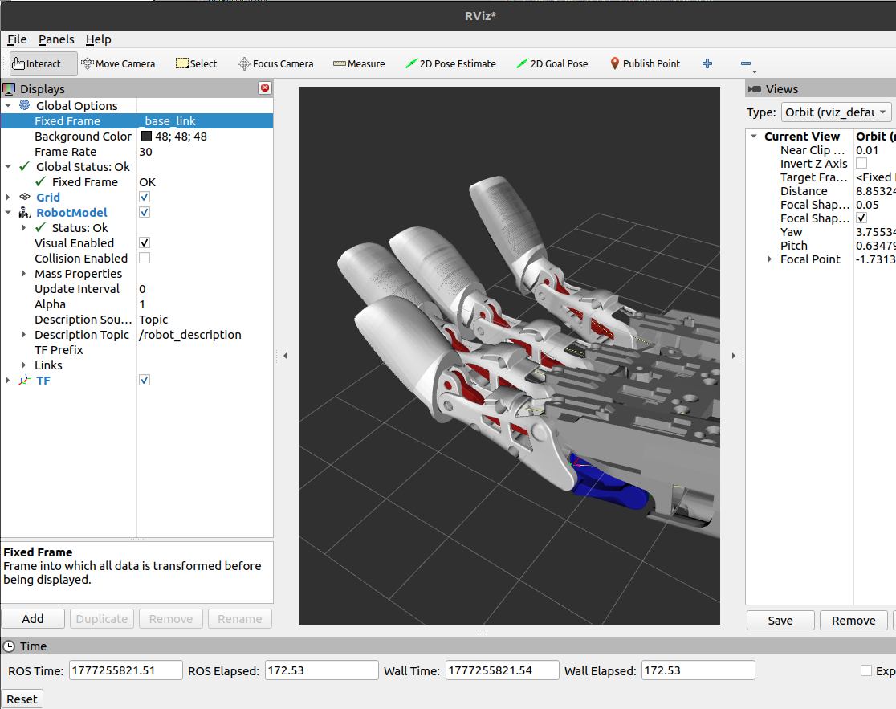
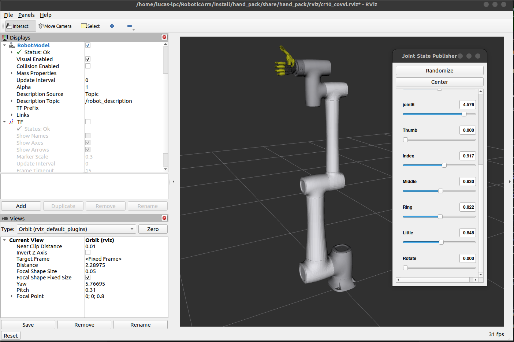
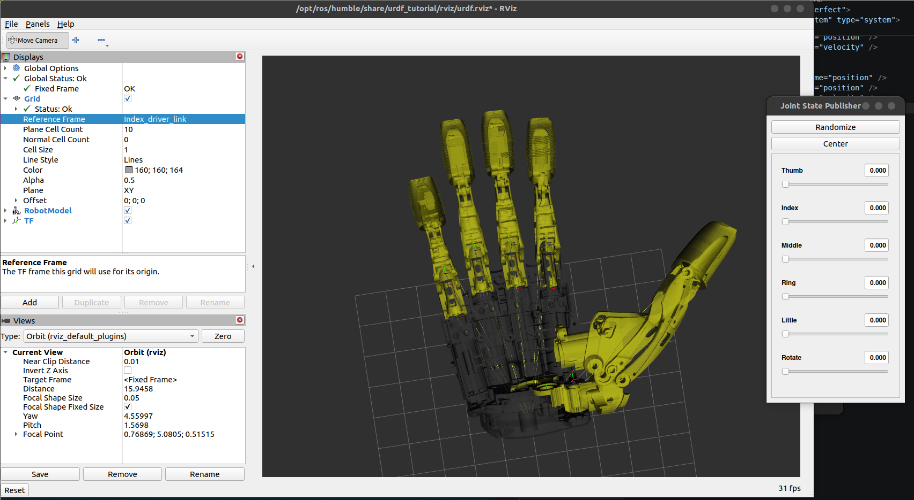

# hand_pack

Support package for the **COVVI Hand** — it holds the combined CR10 + COVVI URDF, launch helpers, URDF post-processing functions and auxiliary GUIs for controlling the hand in isolation.

<p align="center">
  
  
  
</p>
<p align="center"><em>Combined CR10 + COVVI URDF (31 joints: 6 primary + 25 <em>mimic</em>) in RViz — fingers open and closed — and the hand control GUI.</em></p>

<p align="center">
  
  
</p>
<p align="center"><em>The real <strong>COVVI Hand</strong> (left) and the URDF visual mesh in RViz (right), which carries the internal finger linkage geometry the mimic joints reproduce.</em></p>

---

## Contents

```
hand_pack/
├── urdf/
│   └── linear_covvi_hand_gazebo.urdf   Full COVVI hand URDF (31 joints: 6 primary + 25 mimic)
├── config/
│   └── cr10_covvi_controllers.yaml     ros2_control for hand mode: arm JTC + hand JTC
├── launch/
│   ├── cr10_covvi_gazebo.launch.py     Full CR10 + COVVI in Gazebo
│   ├── cr10_covvi_rviz.launch.py       CR10 + COVVI in RViz (visualization only)
│   ├── hand_gazebo.launch.py           COVVI hand alone in Gazebo
│   ├── display.launch.py               URDF display with joint_state_publisher_gui
│   └── spawn_hand.launch.xml           Spawn the hand into an already running Gazebo
├── hand_pack/
│   ├── urdf_helpers.py                 URDF post-processing functions (limits, skin, collision)
│   └── ...
└── meshes/                             COVVI hand STLs and meshes
```

---

## Role

`hand_pack` is not a runtime node — it is a **resource library** used by the other packages:

- `grasp_ml_pack` and `touch_pack` import `urdf_helpers.py` at launch time to post-process the combined URDF.
- The `hand_pack` launches are used for development and standalone visualization.
- `cr10_covvi_controllers.yaml` defines the two JTCs (arm + hand) and is referenced by the `grasp_ml_pack` launch.

---

## How to run

### Launches

```bash
# Full CR10 + COVVI in Gazebo (same stack as grasp_ml_pack, without conveyor/camera)
ros2 launch hand_pack cr10_covvi_gazebo.launch.py

# CR10 + COVVI in RViz — visualization only, no physics simulation
ros2 launch hand_pack cr10_covvi_rviz.launch.py

# COVVI hand alone in Gazebo (no arm)
ros2 launch hand_pack hand_gazebo.launch.py

# URDF viewer with joint sliders (development)
ros2 launch hand_pack display.launch.py

# Spawn the hand into an already running Gazebo
ros2 launch hand_pack spawn_hand.launch.xml
```

<p align="center">
  
  
</p>
<p align="center"><em>Left: <code>cr10_covvi_rviz.launch.py</code> — the combined model driven straight from <code>joint_state_publisher_gui</code>. Right: <code>hand_gazebo.launch.py</code> in <code>worlds/factory.world</code>.</em></p>

### Executables

```bash
# Standalone hand GUI — 6 sliders (Thumb/Index/Middle/Ring/Little/Rotate)
ros2 run hand_pack hand_gui

# Combined GUI — 6 CR10 joints + 6 COVVI digits
ros2 run hand_pack combined_gui
```

<p align="center">
  
  
</p>
<p align="center"><em>Left: the hand URDF alone with every joint at 0 (rest pose). Right: <code>hand_gui</code> over Gazebo — the panel exposes the 6 driver joints <em>and</em> the derived <code>*_distal_j01</code> mimic joints, which is what <code>clamp_hand_joint_limits</code> re-limits.</em></p>

---

## URDF post-processing (`urdf_helpers.py`)

Three functions applied at launch time by `grasp_ml_pack` and `touch_pack`:

### `clamp_hand_joint_limits(urdf_body)`

Propagates the real COVVI firmware limits into the URDF. The raw CAD URDF uses `[0, 1.6 rad]` — the firmware clamps those values via `DigitConfigMsg.open_limit / close_limit`:

```python
HAND_DRIVER_LIMITS = {  # firmware close_limit — slider at 100%
    'Thumb': 1.00, 'Index': 1.00, 'Middle': 1.00,
    'Ring':  1.00, 'Little': 1.00, 'Rotate': 1.00,
}
HAND_DRIVER_LOWER = {   # firmware open_limit — slider at 0% (rest pose)
    'Thumb': 0.08, 'Index': 0.12, 'Middle': 0.12,
    'Ring':  0.12, 'Little': 0.12, 'Rotate': 0.00,
}
```

The limits are propagated to the mimic joints as `[mult · driver_lower, mult · driver_upper]`.

### `inject_visual_skin_layer(urdf_body)`

Adds an inflated visual layer (~3 mm per face) over the phalanges and palm, creating a continuous, smooth surface in Gazebo. Used to simulate the skin of the prosthetic hand.

### `INTER_FINGER_COLLISION_LINKS`

List of links where `self_collide=true` and `mu=2.5` are applied — this lets the fingers physically interact with each other and with objects instead of passing through the geometry.

---

## Controllers (`cr10_covvi_controllers.yaml`)

Two JTCs are active in `hand` mode:

| Controller | Type | Joints |
|---|---|---|
| `cr10_group_controller` | `JointTrajectoryController` | joint1–joint6 |
| `hand_position_controller` | `JointTrajectoryController` | 6 primary + 22 mimic (28 total) |

Update rate: 250 Hz. `allow_partial_joints_goal: true` on the hand controller — this allows sending only the 6 drivers without the mimic joints.

---

## Dependencies

```xml
<depend>robot_state_publisher</depend>
<depend>rviz2</depend>
<exec_depend>gazebo_ros</exec_depend>
<exec_depend>gazebo_ros2_control</exec_depend>
<exec_depend>ros2_control</exec_depend>
<exec_depend>ros2_controllers</exec_depend>
<exec_depend>grasp_ml_pack</exec_depend>  <!-- cage_check (soft-import) -->
```
