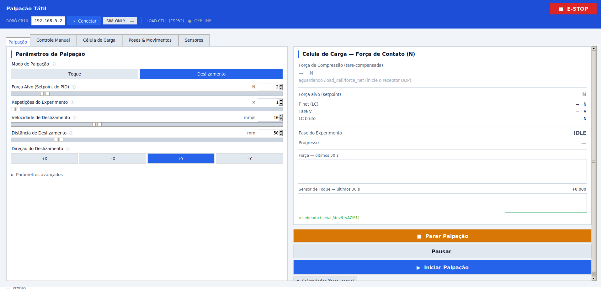
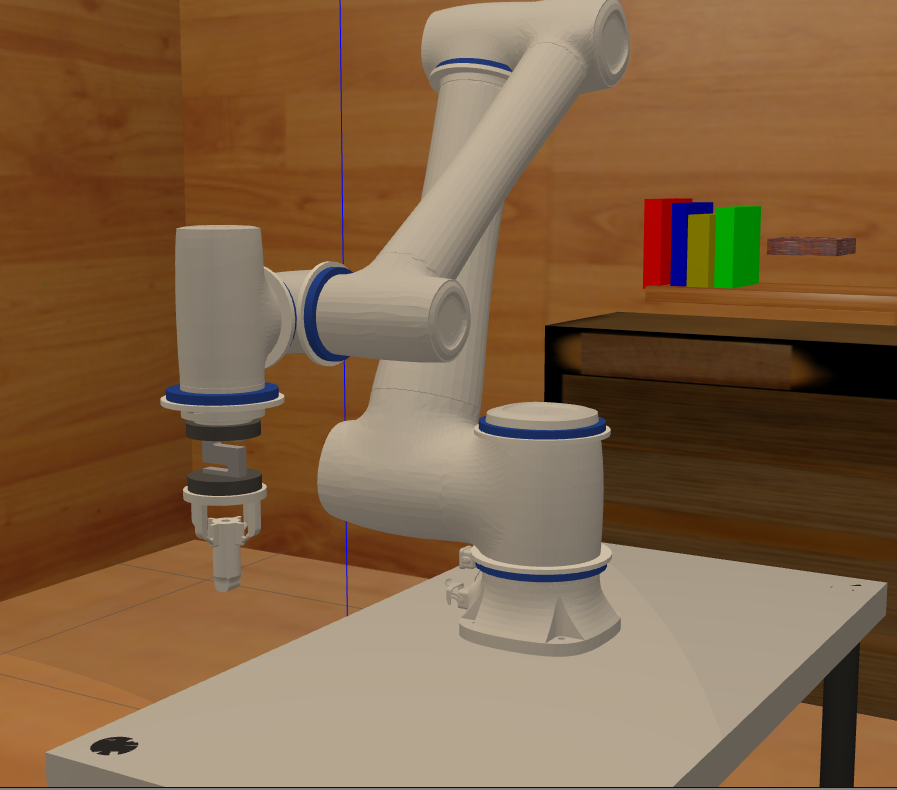
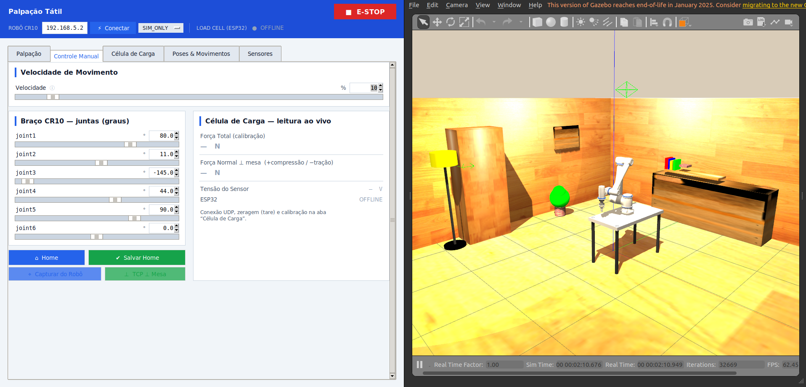
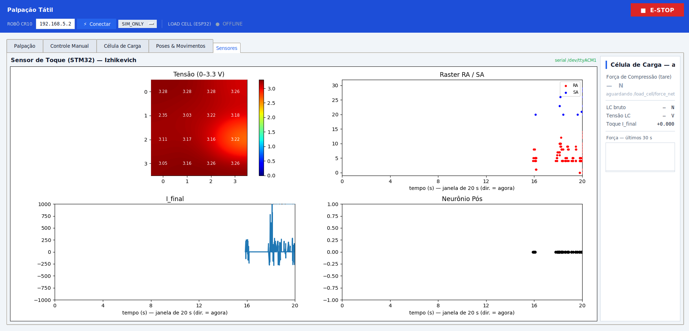
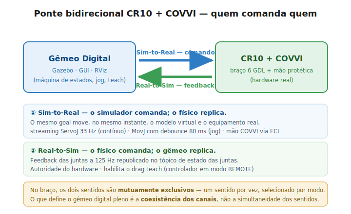
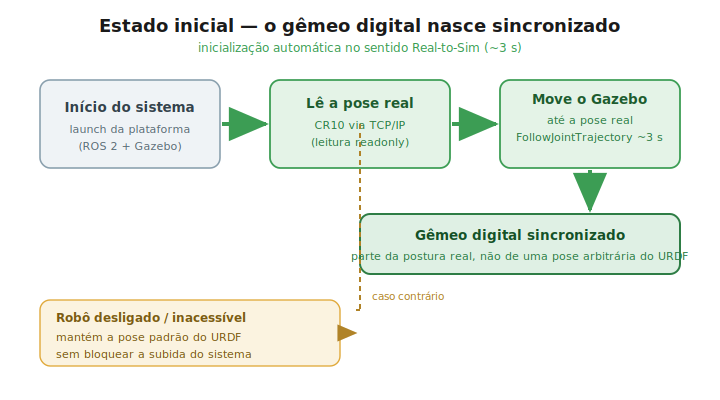
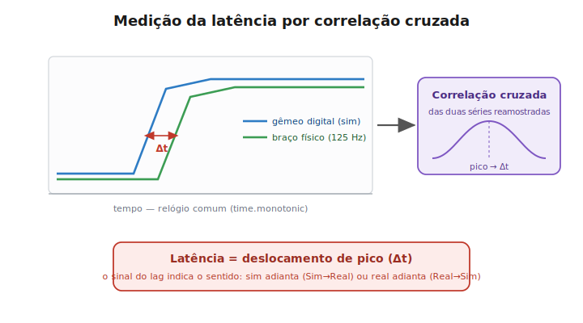

# touch_pack

**Tactile palpation** platform built on the CR10 arm and the TouchTool Square 20×20 mm contact tool (attached to the load cell) — or the Index finger of the COVVI hand. It reproduces the protocol of **Gupta et al. 2021** (approach to a target force, controlled force hold, Cartesian slide and retraction) either in **simulation (SIM_ONLY)** or **mirroring the real robot (MIRROR)**.

It also includes a **neuromorphic touch sensor (STM32, 4×4 array + Izhikevich model)**, **synchronized force + touch recording**, and two **operating modes**: **Touch** (presses with controlled force and returns) and **Slide** (full cycle with a lateral drag).

<p align="center">
  
  
</p>
<p align="center"><em>Left: the palpation scene in Gazebo Classic. Right: the <code>palpation_gui</code> — <strong>Palpation</strong> tab (Slide mode) with live readings from the load cell and the touch sensor.</em></p>

<p align="center">
  
  
</p>
<p align="center"><em>The real end effector: the <strong>100 kg load cell</strong> is bolted between the lower and upper printed couplers, with the TouchTool tip at the end — the physical counterpart of the <code>touch_tool</code> URDF chain (photos show the earlier 5 kg build; the couplers and geometry are the same). Any cell swap requires recalibrating in the GUI's <strong>Calibration</strong> tab.</em></p>

> The GUI is written in Portuguese. Where this README refers to on-screen labels, the original text is given in parentheses.

---

## Palpation modes

The GUI splits palpation into two modes (selector in the **Palpation** (`Palpação`) tab):

| Mode | Cycle executed | Purpose |
|---|---|---|
| **Touch** (`Toque`) | `HOME → DESCENDING → HOLD → RETRACT` (repeated **N touches**) | Press against the table with controlled force and return home — no sliding. The number of touches is selectable. |
| **Slide** (`Deslizamento`) | `HOME → DESCENDING → HOLD → SLIDING → RETRACT` | The full Gupta protocol cycle, with a lateral drag along ±X/±Y. |

Both modes repeat the cycle `repeats` times automatically (between repetitions the arm retracts and returns home).

---

## Protocol / FSM

```
IDLE → HOME → DESCENDING → HOLD → [SLIDING] → RETRACT → HOME → IDLE
```

| Phase | Description |
|---|---|
| **HOME** | Batch joint-space trajectory (JTC S-curve) at ≤ 0.3 rad/s to the initial pose. Checks that the TCP points downward. |
| **DESCENDING** | Jacobian streaming along the approach axis (TCP −Z) with a fast→slow profile. **Force controlled:** it ends when the compression reaches the *setpoint* (`force_n`). `depth_mm` is the **maximum safety** travel. |
| **HOLD** | A force PID brings the compression to the setpoint and **waits for it to settle**: `\|Fz − target\| ≤ tol` for `hold_stable_s` continuous seconds (capped by `hold_timeout_s`). |
| **SLIDING** | (Slide mode only) Lateral Jacobian streaming along ±X/±Y at constant velocity, with a simultaneous force PID on the normal axis and orientation/depth locking. |
| **RETRACT** | Cartesian retreat along +Z (opposite the approach) by `retract_mm`. |

Control runs through **direct streaming** at 33 Hz — no action server, no trajectory queue. Each setpoint is computed and published individually, which keeps latency minimal and makes `stop`/`pause` respond immediately.

**Force safety:** by convention compression is **positive** and traction is negative. A measurement is **aborted** if the compression exceeds **15 N** (`FORCE_ABORT_LIMIT_N`); the PID setpoint is saturated at **10 N**. If the load-cell reading goes stale (> 0.5 s), the force phases abort (`stale`).

---

## Nodes

| Executable | Role |
|---|---|
| `tactile_explorer` | Palpation FSM: subscribes to `/palpation/start`, runs the cycle (Touch/Slide mode), publishes `/palpation/status` |
| `palpation_gui` | Tkinter GUI: parameters, modes, manual control, load-cell calibration, poses/motions, touch-sensor dashboard |
| `palpation_logger` | Writes one CSV + JSON per run into `sensors/Data/` |
| `palpation_report` | Generates a per-cycle statistical report from the run CSVs |
| `force_receiver` | Receives UDP from the ESP32 (port **8080**) → `/load_cell/voltage`, `/load_cell/force`, `/load_cell/calibrated` |
| `touch_receiver` | Receives UDP from the touch-sensor plotter (port **8081**) → `/touch_sensor/value` |
| `force_sync` | Pairs force × touch by arrival → `/touch_sync/data` (`SyncedTouch`) at 50 Hz |
| `mirror_node` | Mirrors sim → real CR10 **without the GUI** (covers `no_gui:=true` in MIRROR) |
| `real_pose_sync` | Moves the simulated arm to the real robot's pose at startup (single use in the launch) |

---

## How to run

```bash
source install/setup.bash

# Full cell (Gazebo + CR10 + GUI + logger + force_rx + touch_rx)
ros2 launch touch_pack tactile_cell.launch.py

# Tactile tip + load cell (unlocks the Palpation tab) and mirroring of the real robot
ros2 launch touch_pack tactile_cell.launch.py \
    end_effector:=touch_tool \
    control_mode:=mirror \
    robot_ip:=192.168.5.2

# Headless (no Tkinter GUI) — mirror_node takes over the mirroring
ros2 launch touch_pack tactile_cell.launch.py control_mode:=mirror no_gui:=true
```

<p align="center">
  
</p>
<p align="center"><em><code>end_effector:=touch_tool</code> in <code>worlds/research_lab.world</code> — the arm carries the contact tip instead of the COVVI hand, which is what unlocks the Palpation tab.</em></p>

### Launch arguments

| Argument | Default | Values |
|---|---|---|
| `end_effector` | `hand` | `hand` (COVVI hand control) · `touch_tool` (palpation tip + load cell) |
| `control_mode` | `sim_only` | `sim_only` · `mirror` · `real_from_sim` |
| `robot_ip` | `192.168.5.2` | IP of the real CR10 controller |
| `no_gui` | `false` | `true` = no Tkinter (uses `mirror_node` in MIRROR) |

> The **Palpation** tab/mode is only active with `end_effector:=touch_tool` (it needs the load cell). With `hand` the GUI shows the hand controls instead.

---

## GUI (`palpation_gui`)

A notebook with 5 tabs: **Palpation** (`Palpação`) · **Manual Control** (`Controle Manual`) · **Load Cell** (`Célula de Carga`) · **Poses & Motions** (`Poses & Movimentos`) · **Sensors** (`Sensores`).

### Palpation tab
- **Mode selector**: Touch / Slide (shows or hides the slide parameters).
- **Target force** (PID setpoint, 1–10 N, integer) · **Repetitions / Number of touches**.
- **Slide** (that mode only): velocity (mm/s), distance (mm), direction ±X/±Y.
- **Advanced** (collapsible): max descent depth, PID Kp/Ki/Kd, approach velocity, and HOLD settling (band tolerance, stable window, timeout).
- Live **load-cell** reading + a force sparkline.
- **Start / Stop / ⏸ Pause** buttons and **Save data (force+touch)**.
- Parameters persist between sessions (including the selected mode).

### Manual Control tab
- 6 CR10 arm sliders + (in `hand` mode) 6 COVVI hand sliders.
- Open / Point / Close presets · SpeedFactor (%) · trajectory duration.
- Home button and custom-Home saving · load-cell mini panel.

<p align="center">
  
</p>
<p align="center"><em><strong>Manual Control</strong> tab next to Gazebo: jogging the 6 CR10 joints with the load cell read live (jog uses <code>MovJ</code> when in MIRROR).</em></p>

### Load Cell tab
- **Reading**: live force/voltage + tare.
- **Calibration**: a wizard that collects (mass kg, voltage V) pairs and runs a linear regression (slope/intercept).

### Poses & Motions tab
- **Capture a pose** from the real robot (feedback port) or from Gazebo (`/joint_states`).
- **Drag Teach**: releases the real arm (`DragTeachSwitch`); Gazebo mirrors the manual motion at 33 Hz; drag is detected automatically from joint movement.
- **Motions**: sequences of N poses + a velocity → interpolated in Gazebo and paced as `MovJ` on the real arm (MIRROR).
- Persisted in `~/.config/touch_pack/poses.json`.

### Sensors tab
A dashboard for the **touch sensor (STM32, Izhikevich)** with 4 embedded matplotlib plots:
**voltage heatmap (4×4)** · **RA/SA raster** (5 s sliding window) · **I_final** · **postsynaptic neuron**, alongside the live load-cell reading.
Rendered with **blitting** (`FuncAnimation` @ 20 Hz) — only the artists that change are redrawn, and it pauses when the tab is not visible (no freezing, the raster scrolls smoothly).

<p align="center">
  
</p>
<p align="center"><em><strong>Sensors</strong> tab: 4×4 voltage heatmap, RA/SA raster, <code>I_final</code> current and the postsynaptic neuron response (Izhikevich), read from the STM32 over USB-CDC.</em></p>

### Header
- Hand and CR10 arm IPs + Connect/Disconnect · SIM_ONLY ↔ MIRROR dropdown · ECI ON/OFF · PWR ON/OFF · E-STOP.

---

## Touch sensor (STM32)

A **4×4 taxel** array read over USB-CDC (115200 baud, ACM/USB port auto-detection). The firmware emits voltages, RA/SA *spikes* (neuromorphic model) and the final current `I_final` of the postsynaptic neuron (**Izhikevich** model).

- `touch_source.py` (`TouchSensorSource`) reads the serial port directly on the GUI's PC and feeds the **Sensors** tab; it publishes `/touch_sensor/value` (throttled to 100 Hz).
- Without a local serial port, `touch_receiver` receives the reading relayed over UDP (port **8081**) and publishes the same `/touch_sensor/value` — the GUI falls back to that mode automatically.

---

## Force × touch synchronization

`force_sync` pairs the latest fresh sample of `/load_cell/force` with the latest of `/touch_sensor/value` and publishes `touch_pack_msgs/SyncedTouch` on `/touch_sync/data` at **50 Hz** (the load cell's own rate). Each pair carries `load_cell_age_ms` / `touch_age_ms` so the synchronization quality can be assessed *a posteriori*.

---

## Where the data is saved

Everything goes to **`<repo_root>/sensors/Data/`** (override with the `TOUCH_PACK_DATA_DIR` environment variable). The directory is located automatically by walking up from the package until `sensors/` is found — this works both when running from `src/` and from `install/`.

| File | Source | Contents |
|---|---|---|
| `<ts>__samples.csv` | `palpation_logger` | `t_rel_s, cycle, phase, force_net_n, q1..q6, tcp_x/y/z, touch_value, touch_age_ms` — one row per sample |
| `<ts>__params.json` | `palpation_logger` | parameters from `/palpation/start` (read by `palpation_report`) |
| `<ts>__sensors.csv` | the GUI's **Save data (force+touch)** button | 50 Hz snapshot: net force, raw LC, LC voltage, `touch_i_final` and the **16 taxel voltages** (`v00..v33`) |

- The run closes automatically on `DONE`/`ABORTED`; a watchdog closes it if samples stop arriving.
- Periodic flushing — no data is lost if the node dies.

---

## ROS interfaces (`touch_pack_msgs`)

### `/palpation/start` — `touch_pack_msgs/PalpationStart`
A **typed** message (it replaces the old JSON inside `std_msgs/String`):

| Field | Meaning |
|---|---|
| `mode` | `'TOUCH'` (touch) · `'SLIDE'` (slide) · empty = SLIDE |
| `force_n` | force PID setpoint (N, compression) |
| `depth_mm` | maximum descent travel — safety |
| `speed_mms` · `slide_dist_mm` · `slide_dir` | slide parameters (`+X`/`-X`/`+Y`/`-Y`) |
| `kp` · `ki` · `kd` | force PID gains ((m/s)/N) |
| `approach_speed_mms` | descent/retreat velocity |
| `repeats` | number of cycles / touches (≥ 1) |
| `speed_factor_pct` | real arm SpeedFactor (%) |
| `home_deg[6]` | arm home (degrees, joint1..joint6) |
| `hold_tol_n` · `hold_stable_s` · `hold_timeout_s` | HOLD settling (0 = default) |

### `/palpation/status` — `touch_pack_msgs/PalpationStatus`
`phase`, `cycle`, `cycles_total`, `target_depth_mm`, `target_force_n`, `force_net_n`, `speed_mms`, `paused`.

### Other topics
| Topic | Type | Description |
|---|---|---|
| `/palpation/stop` | `std_msgs/String` | stops the experiment |
| `/palpation/pause` | `std_msgs/Bool` | pauses (holds position) / resumes |
| `/load_cell/voltage` | `std_msgs/Float32` | raw load-cell voltage (V) |
| `/load_cell/force` | `std_msgs/Float32` | calibrated force (N, compression +) |
| `/load_cell/force_net` | `std_msgs/Float32` | **tare-compensated** force (published by the GUI; consumed by the explorer/logger) |
| `/load_cell/calibrated` | `std_msgs/Bool` | calibration loaded |
| `/touch_sensor/value` | `std_msgs/Float32` | touch-sensor reading |
| `/touch_sync/data` | `touch_pack_msgs/SyncedTouch` | synchronized force × touch pair (50 Hz) |

---

## Triggering palpation from the terminal

```bash
# Touch mode — 3 touches at 2 N
ros2 topic pub --once /palpation/start touch_pack_msgs/msg/PalpationStart \
  "{mode: 'TOUCH', force_n: 2.0, depth_mm: 30.0, repeats: 3,
    approach_speed_mms: 50.0, speed_factor_pct: 10.0,
    kp: 0.001, ki: 0.0005, kd: 0.0}"

# Slide mode — 50 mm along +Y at 10 mm/s
ros2 topic pub --once /palpation/start touch_pack_msgs/msg/PalpationStart \
  "{mode: 'SLIDE', force_n: 2.0, depth_mm: 30.0, speed_mms: 10.0,
    slide_dist_mm: 50.0, slide_dir: '+Y', repeats: 1,
    approach_speed_mms: 50.0, speed_factor_pct: 10.0,
    kp: 0.001, ki: 0.0005, kd: 0.0}"

# Monitor the FSM
ros2 topic echo /palpation/status

# Stop / pause
ros2 topic pub --once /palpation/stop  std_msgs/msg/String "data: 'stop'"
ros2 topic pub --once /palpation/pause std_msgs/msg/Bool   "data: true"
```

FSM phases: `IDLE · HOME · DESCENDING · HOLD · SLIDING · RETRACT · DONE · ABORTED`

---

## Kinematics (`kinematics.py`)

FK and Jacobian for the selected end effector:

```python
T_TOUCH_TOOL_ATTACH  # tactile tip TCP — +188.5 mm in Z from Link6 (tcp_link)
T_HAND_ATTACH        # COVVI hand attachment (prosthesis coupler)
```

URDF chain of the touch_tool (couplers fitted onto the load cell):
```
Link6 → lower_coupling → force_sensor (+7mm) → upper_coupling (+59mm)
      → touch_tool (+74mm) → tcp_link (+188.5mm)
```

Real arm ↔ URDF convention: joint offsets are handled in `kinematics.py` (joints 2 and 4 have an offset relative to DH); `_HOME_Q` and `JOINT_MIN/MAX` are also in the URDF convention.

---

## MIRROR mode — mirroring the real robot

In MIRROR, the commands published on `/cr10_group_controller/joint_trajectory` reach the real CR10:

- **Palpation running**: `ServoJ` at 33 Hz with the position from `/joint_states` (minimal latency for force control).
- **Manual jog (IDLE)**: `MovJ` with an 80 ms debounce from the last published point.
- **Drag Teach**: polls the real arm at 33 Hz and publishes into Gazebo (mirrors the manual motion).
- **No GUI** (`no_gui:=true`): `mirror_node` reproduces the core of that behavior.

The real arm's velocity is set by `SpeedFactor(%)` — synchronized with the GUI slider (forced to 10 % during palpation for safety).

<p align="center">
  
</p>
<p align="center"><em>Only one direction is active at a time, selected by mode. <strong>Sim-to-Real</strong>: the same goal moves the virtual model and the real equipment at once. <strong>Real-to-Sim</strong>: the hardware has authority, which is what makes drag teach possible (controller in REMOTE mode). Diagram labels are in Portuguese.</em></p>

### Startup synchronization (`real_pose_sync`)

<p align="center">
  
</p>
<p align="center"><em>The twin is born synchronized: at launch the real CR10 pose is read over TCP/IP (read-only) and Gazebo is driven to it (~3 s). If the robot is off or unreachable, the default URDF pose is kept and the system still comes up.</em></p>

<p align="center">
  
</p>
<p align="center"><em>The same initial state on both sides — real arm and Gazebo — right after startup synchronization.</em></p>

### Measuring the mirroring latency

<p align="center">
  
</p>
<p align="center"><em>Latency is measured by cross-correlating the simulated joint series with the physical one (125 Hz) on a common <code>time.monotonic</code> clock. The peak gives Δt; the sign of the lag tells which side leads — sim ahead (Sim→Real) or real ahead (Real→Sim). See <code>latency_probe.py</code>. Diagram labels are in Portuguese.</em></p>

---

## Load cell (ESP32)

`force_receiver` opens UDP on port **8080** and waits for broadcasts from the ESP32.

**Payload** (little-endian, 8 bytes): `float v_sensor; float force_filtered;` (the second one is ignored — the force is recomputed with the PC's calibration).

The calibration is read from `~/.config/touch_pack/load_cell_calib.json` and reloaded periodically; it is produced by the wizard in the Load Cell tab.

---

## Persistent files

| Path | Contents |
|---|---|
| `~/.config/touch_pack/robot.json` | IPs (hand/arm) + last mode (SIM_ONLY/MIRROR) |
| `~/.config/touch_pack/home_pose.json` | custom arm home |
| `~/.config/touch_pack/load_cell_calib.json` | calibration slope/intercept |
| `~/.config/touch_pack/palpation_params.json` | last palpation parameters (including the mode) |
| `~/.config/touch_pack/poses.json` | recorded poses and motions |
| `<repo>/sensors/Data/` | palpation data and the force+touch stream |

---

## Dependencies

```bash
sudo apt install ros-humble-admittance-controller \
                 ros-humble-kinematics-interface-kdl \
                 ros-humble-force-torque-sensor-broadcaster
pip install "numpy<2" matplotlib pyserial   # matplotlib/pyserial: Sensors tab (optional)
```

> Without `matplotlib`/`pyserial` the GUI still works in a degraded mode (the Sensors tab is disabled; the rest of the palpation works normally).
